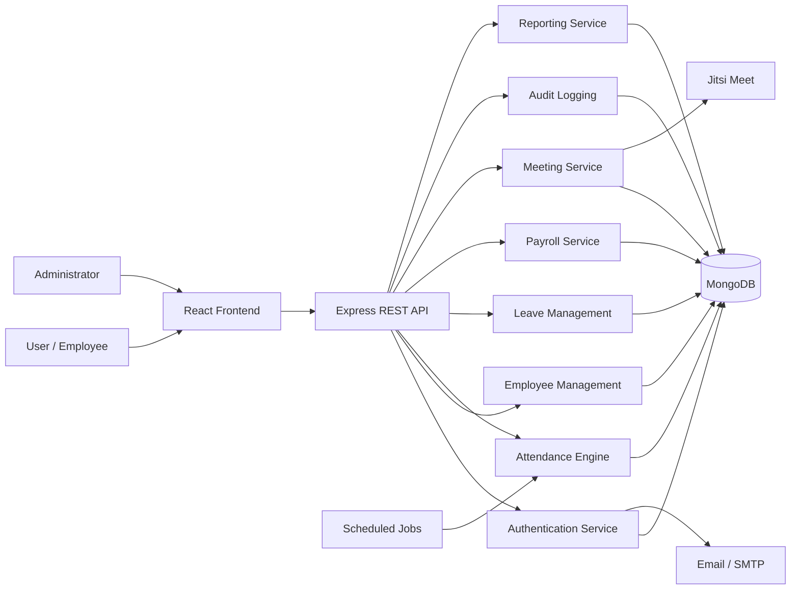
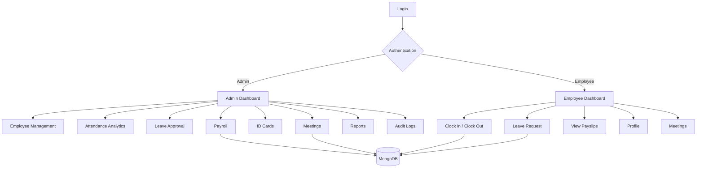

<div align="center">

  <!-- Hero Header Banner -->
  

  <!-- Animated Typing Feature Subtitle -->
  <a href="https://git.io/typing-svg">
    
  </a>

  <br/><br/>

  <!-- Primary Call-to-Action Buttons -->
  <a href="https://techtitans-ems.vercel.app/" target="_blank">
    
  </a>
  <a href="https://techtitans-ems-server.vercel.app/" target="_blank">
    
  </a>
  <a href="https://github.com/asam0816/EMS-Employee-Management-System" target="_blank">
    
  </a>

  <br/><br/>

  <!-- Core Tech Stack Badges -->
  
  
  
  
  
  

  <br/><br/>

  <!-- Metadata & Project Status Chips -->
  
  
  
  
  

</div>
---

# 🏢 Employee Management System

**EMS — Employee Management System** is a comprehensive full-stack web application designed to help organizations manage their workforce from a centralized digital platform.

The system provides dedicated functionality for **administrators and employees**, including employee management, attendance tracking, shift management, leave processing, payroll and payslips, employee ID cards, meetings, audit logs, dashboards, reporting, profile management, and authentication.

Unlike a basic CRUD application, EMS includes automated workforce processes such as **shift-aware attendance, late-time calculations, automatic clock-out, live working-hour updates, monthly attendance analytics, PDF generation, barcode-based employee ID cards, meeting rooms, and activity auditing**.

The platform is built using a modern **MERN-style architecture** with **React, Vite, Tailwind CSS, Node.js, Express.js, MongoDB, and Mongoose**.

---

# ✨ Key Features

## 🔐 Authentication & Authorization

* Secure email and password authentication
* JWT-based authentication
* Passwords protected using bcrypt hashing
* Admin and Employee role separation
* Protected frontend routes
* Protected backend API endpoints
* Admin-only authorization middleware
* Session validation
* Change password functionality
* Forgot password functionality
* Secure password reset token generation
* Password-reset email delivery
* Password reset link expiration
* Logout functionality
* Authentication activity auditing

---

# 👨‍💼 Role-Based Access Control

EMS supports two primary system roles:

| Role         | Main Permissions                                                                                                        |
| ------------ | ----------------------------------------------------------------------------------------------------------------------- |
| **ADMIN**    | Manage employees, attendance analytics, leave approvals, payroll, ID cards, meetings, audit logs and reports            |
| **EMPLOYEE** | View dashboard, manage profile, clock in/out, view attendance, request leave, view payslips and participate in meetings |

Role verification occurs on both the **frontend and backend**, preventing unauthorized users from accessing administrator functionality.

---

# 📊 Admin Dashboard

The administrator dashboard provides a centralized overview of workforce activity.

### Dashboard KPIs

* Total Employees
* Active Employees
* Inactive Employees
* Employees Joined This Month
* Present Today
* Attendance Percentage
* Employees On Leave
* Pending Actions

### Attendance Analytics

* Today's attendance overview
* Present employee count
* Late employee count
* Absent employee count
* Employees on approved leave
* Weekly attendance trend
* Monthly attendance analysis
* Attendance percentage per employee
* Attendance by department

### Workforce Monitoring

Administrators can identify:

* Low attendance
* Late employees
* Leave-related issues
* Pending requests
* Payroll information
* Workforce trends

### Monthly Filtering

The dashboard supports month-based analytics so administrators can review workforce performance for different reporting periods.

---

# 👥 Employee Management

Administrators can centrally manage employee records.

### Employee Information

The system supports:

* First Name
* Last Name
* Email
* Phone Number
* National ID Number
* Job Position
* Department
* Join Date
* Employment Status
* Shift
* Basic Salary
* Allowances
* Deductions
* Employee Bio
* Profile Image

### Employee Operations

Administrators can:

* Create employees
* View employees
* Update employees
* Deactivate employees
* Manage employment status
* Assign departments
* Assign DAY or NIGHT shifts
* Manage salary information

---

# ⏱️ Smart Attendance Management

EMS includes a more advanced attendance system than a standard check-in/check-out application.

Employees can:

* Clock in
* Clock out
* View today's attendance
* View attendance history
* View working hours
* View late status
* View attendance day classification

---

## 🌅 Day & Night Shift Support

The attendance engine supports:

```text
DAY SHIFT
    ↓
Employee Clock In
    ↓
Late Time Calculation
    ↓
Live Working Hours
    ↓
Scheduled Shift End
    ↓
Clock Out / Automatic Clock Out
```

and:

```text
NIGHT SHIFT
    ↓
Employee Clock In
    ↓
Cross-Midnight Attendance
    ↓
Live Working Hours
    ↓
Next-Day Shift End
    ↓
Automatic Clock Out
```

Shift types:

```text
DAY
NIGHT
```

---

# ⏰ Automatic Clock-Out System

EMS contains background jobs that automatically process open attendance records.

The system can automatically clock employees out when their scheduled shift ends.

### Attendance States

```text
WORKING
COMPLETED
AUTO_CLOCKED_OUT
```

The application also performs automatic attendance handling during logout when an employee has an active attendance session.

---

# 🕐 Live Working Hours

While an employee is clocked in, EMS continuously updates their recorded working time.

A scheduled server process recalculates open attendance records every minute.

This allows dashboards and attendance history to display more accurate working-hour information.

---

# 📈 Attendance Classification

Attendance records can be classified as:

```text
PRESENT
LATE
ABSENT
```

EMS also calculates:

* Late minutes
* Total working minutes
* Working hours
* Attendance date
* Shift
* Scheduled end time

---

# 🗓️ Working Day Classification

Based on total working hours, attendance can be categorized into:

```text
Full Day
Three Quarter Day
Half Day
Short Day
```

This allows attendance information to provide more detail than a simple present/absent state.

---

# 📝 Leave Management

Employees can submit leave applications directly from EMS.

### Supported Leave Types

```text
SICK
CASUAL
ANNUAL
```

### Leave Workflow

```text
Employee
   ↓
Submit Leave Request
   ↓
PENDING
   ↓
Admin Review
   ↓
┌─────────────┐
│             │
APPROVED    REJECTED
```

Employees can view the current status of their leave requests.

Administrators can review requests and approve or reject pending applications.

---

# 💰 Payroll & Payslip Management

EMS includes payroll and digital payslip functionality.

Administrators can generate employee payslips using:

* Basic Salary
* Allowances
* Deductions

The system calculates:

```text
Net Salary =
Basic Salary
+ Allowances
- Deductions
```

Employees can access their generated payslips from their accounts.

---

# 🧾 Printable Payslips

Each payslip contains:

* Employee Name
* Position
* Email
* Payroll Month
* Basic Salary
* Allowances
* Deductions
* Net Salary

Payslips include a dedicated print view that can be printed or saved as a PDF through the browser.

---

# 🪪 Employee ID Card System

EMS contains an administrative employee ID-card module.

Administrators can:

* View employee ID cards
* Search by employee
* Search by NIC
* Search by Employee ID
* Generate barcodes
* Download individual ID cards
* Export multiple ID cards to PDF

The system uses:

```text
JsBarcode
    +
html2canvas
    +
jsPDF
```

to convert digital employee cards into downloadable PDF documents.

---

# 📊 Monthly Attendance Reports

Administrators can generate detailed monthly employee attendance reports.

Reports include:

* Working Days
* Present Days
* Absent Days
* Leave Days
* Late Days
* Attendance Percentage
* Department
* Employee Information

Administrators can filter reports by:

* Month
* Department
* Employee Search

---

# 📥 CSV Export

Monthly attendance information can be exported as a **CSV file** for external reporting and analysis.

Example:

```text
monthly-attendance-2026-08.csv
```

This makes it easier to use EMS data with Excel, Google Sheets or other business reporting tools.

---

# 📉 Department Attendance Analytics

Administrators can compare attendance performance across departments.

The dashboard calculates and displays department-level attendance percentages, giving management a clear view of workforce performance.

---

# 🤝 Meeting Management

EMS contains an integrated employee meeting management system.

Administrators can:

* Schedule meetings
* Schedule one-to-one meetings
* Schedule company-wide meetings
* Edit future meetings
* Delete future meetings
* Start meetings
* End meetings
* Add meeting notes
* Add action items
* Add action-item due dates
* Track participants

---

# 🎥 Integrated Video Meetings

Meeting rooms integrate with **Jitsi Meet**.

A unique room is generated for each meeting and embedded directly inside EMS.

Meeting rooms support:

* Camera
* Microphone
* Fullscreen
* Screen sharing

Employees can participate without leaving the workforce management application.

---

# 📅 Meeting Types

Supported meeting types include:

```text
PERFORMANCE
PROJECT
HR_DISCUSSION
ONE_TO_ONE
OTHER
```

Meetings can target:

```text
INDIVIDUAL
ALL EMPLOYEES
```

---

# 🔄 Meeting Workflow

```text
Admin Schedules Meeting
        ↓
Employee Receives Meeting
        ↓
Accept / Decline
        ↓
Scheduled Time Reached
        ↓
Meeting Starts
        ↓
Jitsi Meeting Room
        ↓
Notes + Action Items
        ↓
Meeting Completed
```

### Meeting Statuses

```text
SCHEDULED
ACCEPTED
DECLINED
IN_PROGRESS
COMPLETED
CANCELLED
```

---

# 📝 Meeting Notes & Action Items

Administrators can record structured meeting information including:

* Discussion
* Issues
* Manager Comments
* Action Items
* Action Item Due Dates
* Completion Status

This allows EMS to act as both a meeting platform and a workforce follow-up system.

---

# 🔍 Audit Logging

EMS maintains administrative and security-related activity records.

Audit logs can contain:

* Action
* Entity Type
* Entity ID
* Entity Label
* User who performed the action
* IP Address
* User Agent
* Additional Metadata
* Timestamp

Example activities include:

```text
AUTH_LOGIN
AUTH_LOGOUT
PASSWORD_CHANGED
ATTENDANCE_CLOCK_IN
ATTENDANCE_CLOCK_OUT
```

Audit-log access is restricted to administrators.

---

# 👤 Employee Dashboard

Employees receive a personalized dashboard displaying relevant workforce information.

The dashboard can include:

* Attendance summary
* Days present
* Recent attendance
* Leave information
* Pending leave requests
* Latest payslip
* Profile information
* Quick access to workforce services

---

# ⚙️ Profile & Settings

Users can manage personal account information through the settings interface.

Available functionality includes:

* View profile
* Update profile
* Profile image
* Change password
* Account information
* Security settings

---

# 🔑 Password Recovery

EMS implements a password recovery workflow.

```text
Forgot Password
      ↓
Enter Email
      ↓
Generate Random Reset Token
      ↓
Hash Token Before Storage
      ↓
Send Reset Email
      ↓
15-Minute Expiration
      ↓
Set New Password
```

Reset tokens are generated using Node.js cryptographic functionality and the stored representation is hashed before being saved.

---

# 🧱 System Architecture



---

# 🗄️ Database Architecture

EMS currently uses the following MongoDB models:

```text
User
 ├── Authentication
 ├── Role
 ├── Profile Image
 └── Password Reset Information

Employee
 ├── Personal Information
 ├── Employment Information
 ├── Department
 ├── Shift
 └── Salary Information

Attendance
 ├── Employee
 ├── Attendance Date
 ├── Shift
 ├── Check In
 ├── Check Out
 ├── Working Hours
 ├── Status
 └── Late Minutes

LeaveApplication
 ├── Employee
 ├── Leave Type
 ├── Dates
 ├── Reason
 └── Status

Payslip
 ├── Employee
 ├── Month / Year
 ├── Basic Salary
 ├── Allowances
 ├── Deductions
 └── Net Salary

Meeting
 ├── Audience
 ├── Employee
 ├── Creator
 ├── Meeting Type
 ├── Schedule
 ├── Meeting Room
 ├── Participants
 ├── Notes
 └── Action Items

AuditLog
 ├── Action
 ├── Entity
 ├── User
 ├── IP Address
 ├── User Agent
 └── Metadata
```

---

# 💻 Technology Stack

## Frontend

<p>

</p>

| Technology      | Purpose             |
| --------------- | ------------------- |
| React.js        | Frontend UI         |
| Vite            | Frontend build tool |
| JavaScript      | Application logic   |
| React Router    | Client-side routing |
| Tailwind CSS    | Styling             |
| Axios           | API communication   |
| Lucide React    | Icons               |
| React Hot Toast | Notifications       |
| Date-fns        | Date formatting     |

---

# ⚙️ Backend

<p>

</p>

| Technology | Purpose                         |
| ---------- | ------------------------------- |
| Node.js    | Backend runtime                 |
| Express.js | REST API                        |
| MongoDB    | Database                        |
| Mongoose   | ODM                             |
| JWT        | Authentication                  |
| bcrypt     | Password hashing                |
| Nodemailer | Email delivery                  |
| Multer     | Request/FormData processing     |
| node-cron  | Scheduled jobs                  |
| Inngest    | Background workflow integration |
| CORS       | Cross-origin communication      |

---

# 📄 Document & ID Card Tools

```text
html2canvas
jsPDF
JsBarcode
```

These libraries support employee card rendering, barcode generation and PDF export.

---

# 📂 Project Structure

```text
EMS-Employee-Management-System/
│
├── client/
│   │
│   ├── src/
│   │   ├── api/
│   │   │   └── axios.js
│   │   │
│   │   ├── assets/
│   │   │
│   │   ├── components/
│   │   │   ├── attendance/
│   │   │   ├── dashboard/
│   │   │   ├── idcard/
│   │   │   ├── leave/
│   │   │   ├── meeting/
│   │   │   ├── payslip/
│   │   │   ├── AdminDashboard.jsx
│   │   │   ├── EmployeeDashboard.jsx
│   │   │   ├── EmployeeForm.jsx
│   │   │   ├── EmployeeCard.jsx
│   │   │   ├── LoginForm.jsx
│   │   │   ├── ProfileForm.jsx
│   │   │   └── Sidebar.jsx
│   │   │
│   │   ├── context/
│   │   │   └── AuthContext.jsx
│   │   │
│   │   ├── pages/
│   │   │   ├── Dashboard.jsx
│   │   │   ├── Employees.jsx
│   │   │   ├── Attendance.jsx
│   │   │   ├── Leave.jsx
│   │   │   ├── Payslips.jsx
│   │   │   ├── IDCards.jsx
│   │   │   ├── Meetings.jsx
│   │   │   ├── MeetingRoom.jsx
│   │   │   ├── AuditLogs.jsx
│   │   │   ├── Settings.jsx
│   │   │   ├── ForgotPassword.jsx
│   │   │   ├── ResetPassword.jsx
│   │   │   └── AdminMonthlyEmployeeReport.jsx
│   │   │
│   │   ├── App.jsx
│   │   └── main.jsx
│   │
│   ├── package.json
│   ├── vite.config.js
│   └── vercel.json
│
├── server/
│   │
│   ├── config/
│   │   ├── db.js
│   │   └── nodemailer.js
│   │
│   ├── constants/
│   │   └── departments.js
│   │
│   ├── controllers/
│   │   ├── authController.js
│   │   ├── employeeController.js
│   │   ├── attendanceController.js
│   │   ├── leaveController.js
│   │   ├── payslipController.js
│   │   ├── meetingController.js
│   │   ├── auditController.js
│   │   ├── dashboardController.js
│   │   ├── adminDashboardController.js
│   │   └── reportController.js
│   │
│   ├── jobs/
│   │   ├── autoCheckoutJob.js
│   │   ├── autoClockOutProcessor.js
│   │   └── liveWorkingHoursJob.js
│   │
│   ├── middleware/
│   │   ├── auth.js
│   │   └── requireAdmin.js
│   │
│   ├── models/
│   │   ├── User.js
│   │   ├── Employee.js
│   │   ├── Attendance.js
│   │   ├── LeaveApplication.js
│   │   ├── Payslip.js
│   │   ├── Meeting.js
│   │   └── AuditLog.js
│   │
│   ├── routes/
│   │
│   ├── utils/
│   │   ├── auditLogger.js
│   │   ├── colomboTime.js
│   │   ├── shiftEngine.js
│   │   └── shifts.js
│   │
│   ├── inngest/
│   │
│   ├── seed.js
│   ├── server.js
│   └── package.json
│
└── .gitignore
```

---

# 🌐 Frontend Routes

| Route                    | Access                              | Description             |
| ------------------------ | ----------------------------------- | ----------------------- |
| `/login`                 | Public                              | User login              |
| `/forgot-password`       | Public                              | Request password reset  |
| `/reset-password/:token` | Public                              | Reset password          |
| `/dashboard`             | Authenticated                       | Role-specific dashboard |
| `/employees`             | Authenticated / Admin functionality | Employee management     |
| `/attendance`            | Authenticated                       | Attendance              |
| `/leave`                 | Authenticated                       | Leave management        |
| `/payslips`              | Authenticated                       | Payroll and payslips    |
| `/settings`              | Authenticated                       | Profile and security    |
| `/meetings`              | Authenticated                       | Meeting management      |
| `/meetings/:id`          | Authenticated                       | Meeting room            |
| `/audit-logs`            | Admin                               | Audit logs              |
| `/id-cards`              | Admin                               | Employee ID cards       |
| `/reports/monthly`       | Admin                               | Monthly reports         |
| `/print/payslips/:id`    | Payslip view                        | Printable payslip       |

---

# 🔌 REST API

Base development URL:

```text
http://localhost:5000/api
```

---

## Authentication API

```http
POST /api/auth/login
GET  /api/auth/session
POST /api/auth/change-password
POST /api/auth/forgot-password
POST /api/auth/reset-password/:token
POST /api/auth/logout
```

---

## Employee API

```http
GET    /api/employees
POST   /api/employees
PUT    /api/employees/:id
DELETE /api/employees/:id
```

Employee management endpoints require administrator authorization.

---

## Profile API

```http
GET /api/profile
PUT /api/profile
```

---

## Attendance API

```http
GET  /api/attendance/today
GET  /api/attendance/history
POST /api/attendance/clock-in
POST /api/attendance/clock-out
POST /api/attendance
```

---

## Leave API

```http
GET   /api/leave
POST  /api/leave
PATCH /api/leave/:id
```

Leave approval/rejection requires administrator access.

---

## Payslip API

```http
POST /api/payslips
GET  /api/payslips
GET  /api/payslips/:id
```

---

## Dashboard API

```http
GET /api/dashboard
GET /api/admin-dashboard/summary
GET /api/summary
```

---

## Audit API

```http
GET /api/audit
GET /api/audit/:id
```

Administrator access is required.

---

## Employee ID Card API

```http
GET /api/id-cards
GET /api/id-cards/:id
```

Administrator access is required.

---

## Meeting API

```http
GET    /api/meetings
POST   /api/meetings
GET    /api/meetings/:id
PUT    /api/meetings/:id
DELETE /api/meetings/:id

PATCH /api/meetings/:id/respond
PATCH /api/meetings/:id/start
PUT   /api/meetings/:id/notes
PATCH /api/meetings/:id/end
```

---

## Reporting API

```http
GET /api/reports/admin-attendance
GET /api/reports/admin-attendance/:employeeId
```

---

# 🚀 Getting Started

## 1. Clone the Repository

```bash
git clone https://github.com/asam0816/EMS-Employee-Management-System.git
```

Move into the project:

```bash
cd EMS-Employee-Management-System
```

---

# 📦 Backend Setup

Move into the server:

```bash
cd server
```

Install dependencies:

```bash
npm install
```

---

# 🔐 Backend Environment Variables

Create a file:

```text
server/.env
```

Add:

```env
PORT=5000

MONGODB_URI=your_mongodb_connection_string

JWT_SECRET=your_long_random_jwt_secret

ADMIN_EMAIL=your_admin_email

CLIENT_URL=http://localhost:5173

SMTP_USER=your_smtp_username
SMTP_PASS=your_smtp_password
SENDER_EMAIL=your_sender_email

INNGEST_EVENT_KEY=your_inngest_event_key
INNGEST_SIGNING_KEY=your_inngest_signing_key
```

> Never commit your real `.env` file, MongoDB credentials, SMTP password, JWT secret or Inngest keys to GitHub.

---

# 👨‍💼 Create Initial Admin

The project contains an admin seed script.

Run:

```bash
npm run seed
```

The script creates the administrator account using:

```env
ADMIN_EMAIL
```

After creating the administrator account, change the temporary development password immediately.

For production, the temporary seed password should be moved from the source code into a secure environment variable or replaced with a safer account-provisioning workflow.

---

# ▶️ Start Backend

For the current server script:

```bash
npm start
```

For development with Nodemon:

```bash
npm run server
```

Backend:

```text
http://localhost:5000
```

Test it:

```text
http://localhost:5000/
```

Expected response:

```text
Server is running
```

---

# 🎨 Frontend Setup

Open another terminal and move to the client:

```bash
cd client
```

Install dependencies:

```bash
npm install
```

---

# 🔧 Frontend Environment Variables

Create:

```text
client/.env
```

Add:

```env
VITE_BASE_URL=http://localhost:5000
```

For production, replace it with the deployed backend URL.

Example:

```env
VITE_BASE_URL=https://techtitans-ems-server.vercel.app
```

---

# ▶️ Start Frontend

Run:

```bash
npm run dev
```

The Vite application will normally run at:

```text
http://localhost:5173
```

---

# 🧪 Production Build

Inside the `client` directory:

```bash
npm run build
```

Preview the production build:

```bash
npm run preview
```

---

# 🔒 Security Features

The current project implements several application-security controls:

```text
Password Hashing
        ↓
JWT Authentication
        ↓
Protected API Routes
        ↓
Role-Based Authorization
        ↓
Password Reset Tokens
        ↓
Reset Token Hashing
        ↓
Audit Logging
```

Important security functionality includes:

* bcrypt password hashing
* JWT authentication
* Bearer-token protected APIs
* Admin route authorization
* Cryptographically random password-reset tokens
* Hashed reset tokens in MongoDB
* Expiring reset links
* Generic forgot-password response
* Audit tracking
* Soft employee deletion
* Protected employee data endpoints

---

# ⚠️ Production Security Recommendations

Before deploying EMS in a real production organization:

```text
✓ Use strong JWT secrets
✓ Rotate exposed credentials
✓ Never commit .env files
✓ Restrict CORS to trusted frontend domains
✓ Add API rate limiting
✓ Add Helmet security headers
✓ Add request validation
✓ Add MongoDB input sanitization
✓ Use stronger password requirements
✓ Remove hard-coded seed passwords
✓ Add refresh-token/session rotation
✓ Use HTTPS only
✓ Review role permissions
✓ Add automated testing
```

---

# ☁️ Deployment

The application is designed to support separate frontend and backend deployments.

```text
React / Vite Frontend
        ↓
      Vercel
        ↓
Express REST API
        ↓
      Vercel
        ↓
MongoDB Database
```

### Frontend

```text
https://techtitans-ems.vercel.app/
```

### Backend

```text
https://techtitans-ems-server.vercel.app/
```

Remember to configure the production environment variables in the relevant Vercel projects.

---

# 💡 Application Workflow



---

# 🎯 Project Objectives

The Employee Management System was developed to:

* Digitize workforce administration
* Reduce manual HR processes
* Centralize employee information
* Improve attendance monitoring
* Automate repetitive attendance processes
* Simplify leave management
* Improve payroll accessibility
* Provide workforce analytics
* Support employee-management communication
* Maintain traceable administrative activities
* Provide employees with self-service functionality

---

# 🌟 Highlights

<div align="center">


<br/>


<br/>


</div>

---

# 👨‍💻 Developer

<div align="center">

## Mohamed Asam

**Full Stack Developer | Software Engineer**

<a href="https://asamofficial-portfolio.vercel.app/">

</a>

<a href="https://www.linkedin.com/in/asamofficial16">

</a>

<a href="https://github.com/asam0816">

</a>

<a href="mailto:asamofficial16@gmail.com">

</a>

</div>

---

# 🔮 Future Improvements

Potential future enhancements include:

```text
Employee Notifications
        ↓
Advanced Payroll Calculation
        ↓
Automatic Salary Generation
        ↓
Overtime Management
        ↓
Public Holiday Management
        ↓
Biometric Attendance Integration
        ↓
Real-Time WebSocket Notifications
        ↓
Advanced HR Analytics
        ↓
Performance Management
        ↓
Document Management
        ↓
Mobile Application
```

---

# 🤝 Contributions

Contributions, suggestions and improvements are welcome.

Recommended workflow:

```bash
git checkout -b feature/your-feature
```

Make the required changes and commit:

```bash
git commit -m "Add your feature"
```

Push your branch:

```bash
git push origin feature/your-feature
```

Then create a Pull Request.

---

# ⭐ Support

If you find this project useful or interesting, consider giving the repository a **GitHub Star ⭐**.

<div align="center">

<a href="https://github.com/asam0816/EMS-Employee-Management-System">

</a>

<a href="https://github.com/asam0816/EMS-Employee-Management-System/fork">

</a>

</div>

---

<div align="center">

## 💜 Built With Passion for Modern Workforce Management


<br/><br/>

**React • Node.js • Express.js • MongoDB**

<br/><br/>


<br/><br/>

### © 2026 Mohamed Asam

<br/>


</div>
